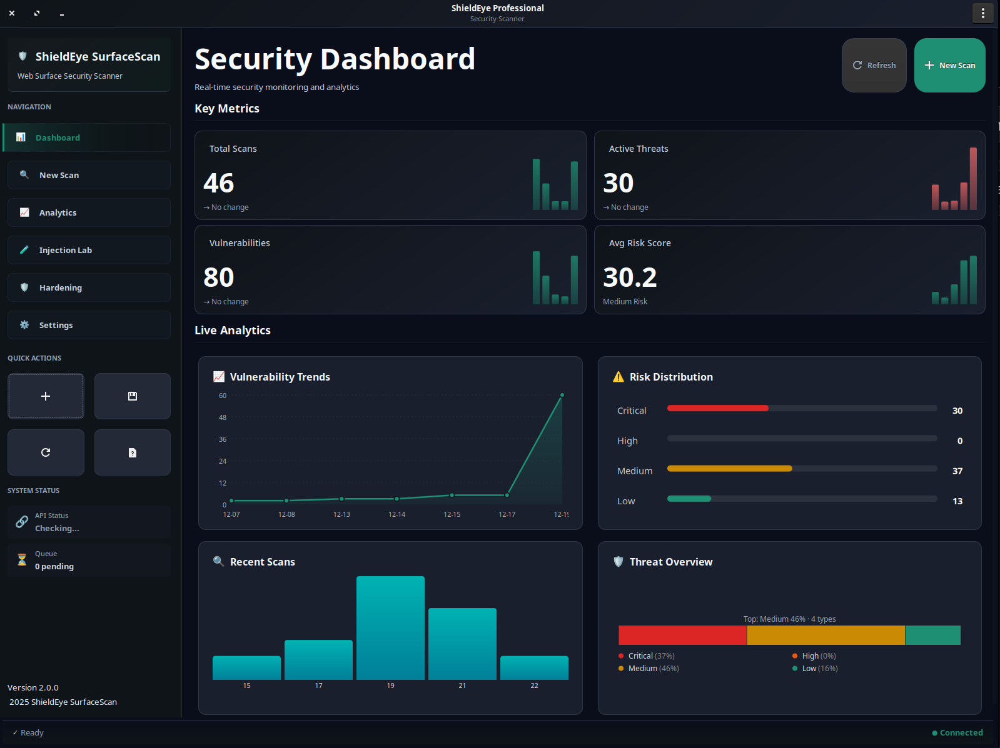
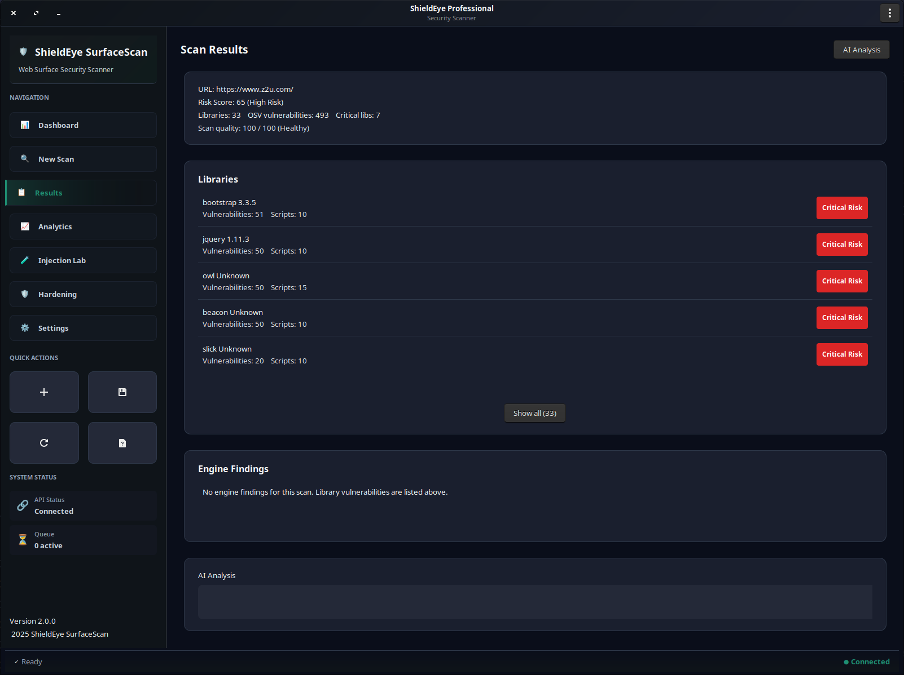
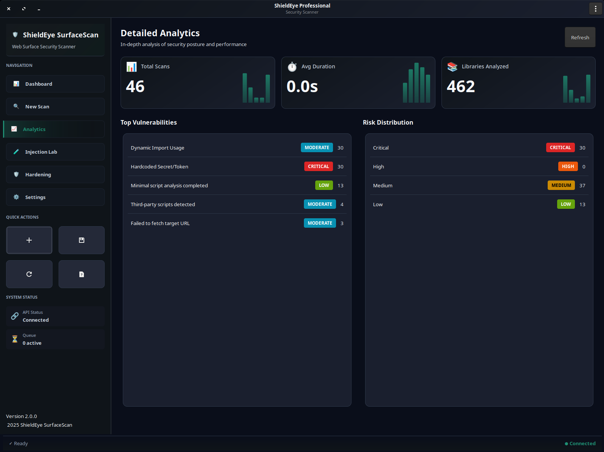
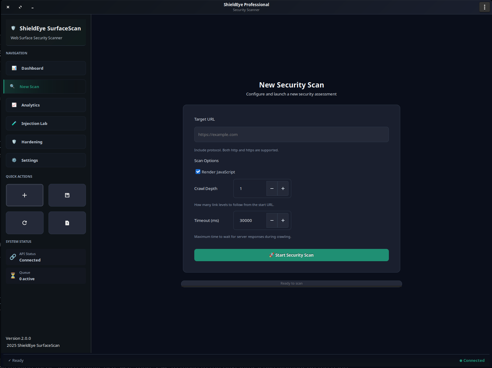

<div align="center">

# 🛡️ ShieldEye SurfaceScan

**Advanced Web Application Surface Scanner**

*Real-time vulnerability detection • Dependency analysis • AI-powered insights*

[](https://opensource.org/licenses/MIT)
[](https://www.typescriptlang.org/)
[](https://nodejs.org/)
[](https://www.python.org/)
[](https://www.docker.com/)
[](https://www.gtk.org/)

[Features](#-key-features) • [Quick Start](#-quick-start) • [Screenshots](#-screenshots) • [Documentation](#-documentation) • [Contributing](#-contributing)

---

<!-- 
  📸 SCREENSHOT: Main application window showing the Dashboard view
  Recommended size: 900x600px or similar widescreen ratio
  Show: Dashboard with charts, recent scans list, and threat overview
-->


</div>

---

## 🎯 What is ShieldEye SurfaceScan?

ShieldEye SurfaceScan is a **comprehensive security scanning platform** that analyzes web applications for vulnerabilities, misconfigurations, and security risks. It combines:

- 🌐 **Headless browser automation** (Playwright) for full JavaScript execution
- 📦 **Intelligent dependency analysis** with CVE/vulnerability mapping
- 🤖 **AI-powered threat intelligence** via LLM integration (Ollama)
- 🖥️ **Native desktop GUI** built with GTK3 for intuitive operation

Whether you're a security researcher, developer, or DevSecOps engineer, ShieldEye provides actionable insights into your web application's security posture.

---

## ✨ Key Features

<table>
<tr>
<td width="50%">

### 🔍 Dynamic Scanning
- Full JavaScript execution via Playwright
- DOM analysis and resource extraction
- External script fetching and fingerprinting
- Network request monitoring

### 📦 Dependency Analysis
- Automatic library detection (React, Vue, jQuery, etc.)
- Version fingerprinting with multiple heuristics
- Real-time CVE lookup via OSV and NVD
- Risk scoring based on vulnerability severity

</td>
<td width="50%">

### 🔐 Security Checks
- HTTP security headers (CSP, HSTS, X-Frame-Options)
- CORS misconfiguration detection
- Mixed content warnings
- Cookie security analysis
- Login form security assessment

### 🤖 AI Integration
- LLM-powered threat analysis (Ollama)
- Intelligent security recommendations
- Hardening suggestions generator
- Prompt injection testing lab

</td>
</tr>
</table>

---

## 🖼️ Screenshots

<div align="center">

<!-- 
  📸 SCREENSHOT: Dashboard view
  Show: Overall risk summary, recent scans list, key metrics
-->
| Dashboard | Results |
|:---------:|:-------:|
|  |  |
| *High-level security posture and recent activity* | *Detailed findings with severity levels* |

<!-- 
  📸 SCREENSHOT: Analytics view with charts
  Show: Risk distribution chart, findings over time, severity breakdown
-->

<!-- 
  📸 SCREENSHOT: New Scan view with URL input and options
  Show: Scan configuration panel with URL field, timeout, depth options
-->
| Analytics | New Scan |
|:---------:|:--------:|
|  |  |
| *Visual security metrics and trends* | *Configure and launch new scans* |

</div>

---

## 🏗️ Architecture

ShieldEye uses a **microservices architecture** for scalability and modularity:

```
┌──────────────────────────────────────────────────────────────┐
│                        GTK Desktop GUI                        │
│                    (Python 3 + PyGObject)                     │
└─────────────────────────────┬────────────────────────────────┘
                              │ HTTP/REST
                              ▼
┌──────────────────────────────────────────────────────────────┐
│                      API Gateway (Express.js)                 │
│              Rate limiting • Validation • Routing             │
└───────┬─────────────────────┬─────────────────────┬──────────┘
        │                     │                     │
        ▼                     ▼                     ▼
┌───────────────┐    ┌───────────────┐    ┌───────────────┐
│   Renderer    │    │   Analyzer    │    │   LLM Proxy   │
│  (Playwright) │    │ (Vuln Check)  │    │   (Ollama)    │
└───────────────┘    └───────────────┘    └───────────────┘
        │                     │
        └──────────┬──────────┘
                   ▼
    ┌─────────────────────────────────┐
    │     PostgreSQL  •  Redis  •  MinIO     │
    │     (Data)       (Queue)    (Storage)  │
    └─────────────────────────────────┘
```

### Tech Stack

| Layer | Technology |
|-------|------------|
| **Frontend** | GTK3, Python 3.10+, PyGObject |
| **API** | Node.js 18+, Express.js, TypeScript |
| **Browser** | Playwright (Chromium) |
| **Database** | PostgreSQL 15 |
| **Queue** | Redis 7 + Bull |
| **Storage** | MinIO (S3-compatible) |
| **AI** | Ollama (local LLM) |

---

## 🚀 Quick Start

### Prerequisites

| Requirement | Version | Notes |
|-------------|---------|-------|
| Docker | Latest | With `docker compose` plugin |
| Python | 3.10+ | With GTK3 and PyGObject |
| Node.js | 18+ | Optional, for local development |
| Ollama | Latest | Optional, for AI features |

### 1. Clone and Configure

```bash
git clone https://github.com/exiv703/ShieldEye-SurfaceScan.git
cd ShieldEye-SurfaceScan

# Create your environment file
cp .env.example .env

# Edit .env and set your secrets (especially for production)
```

### 2. Start Backend Services

```bash
# Start all services (PostgreSQL, Redis, MinIO, API, Renderer, Analyzer)
docker compose up -d

# Verify services are running
docker compose ps
```

### 3. Launch the GUI

```bash
# Interactive launcher with menu
./run.sh

# Or directly
cd gtk_gui_pro && python3 main.py
```

### 4. (Optional) Start Ollama for AI Features

```bash
# Install and run Ollama
ollama serve

# Pull a model (e.g., llama3.2 or mistral)
ollama pull llama3.2
```

---

## 🎮 Using `run.sh`

The launcher script provides an interactive menu for common operations:

```
Choose launch mode:
  1) 🚀 Full stack (backend + API + GUI)
  2) 🖥️  GUI only
  3) 🧱 Backend services only
  4) 🧩 API only
  5) 🗄️  Reset analytics data (truncate DB)
  6) 👋 Exit
  7) 🚀 Full stack (rebuild backend images + GUI)
  8) ℹ️  Install requirements (check deps + Python GUI packages)
```

**Command-line options:**

```bash
./run.sh --mode full          # Start everything
./run.sh --mode gui           # GUI only (backend must be running)
./run.sh --install-reqs       # Check and install dependencies
./run.sh --help               # Show all options
```

---

## ⚙️ Configuration

### Environment Variables

Copy `.env.example` to `.env` and configure:

| Variable | Description | Default |
|----------|-------------|---------|
| `DB_PASSWORD` | PostgreSQL password | `CHANGE_ME` |
| `MINIO_SECRET_KEY` | MinIO secret key | `CHANGE_ME` |
| `JWT_SECRET` | JWT signing secret | `CHANGE_ME` |
| `ENCRYPTION_KEY` | Data encryption key (32 chars) | `CHANGE_ME` |
| `LLM_BASE_URL` | Ollama API URL | `http://localhost:11434` |
| `LLM_MODEL` | LLM model name | `llama3.2` |

> ⚠️ **Security Note:** Always change default secrets before any production or public deployment.

### Full Requirements

See [`REQUIREMENTS.md`](REQUIREMENTS.md) for complete system requirements and setup instructions.

---

## 📖 Documentation

| Document | Description |
|----------|-------------|
| [`REQUIREMENTS.md`](REQUIREMENTS.md) | System requirements and setup guide |
| [`gtk_gui_pro/requirements.txt`](gtk_gui_pro/requirements.txt) | Python dependencies |
| [`docs/guides/`](docs/guides/) | Integration and usage guides |
| [`docs/audits/`](docs/audits/) | Security and technical audits |

---

## 🔌 API Reference

### Create Scan

```bash
curl -X POST http://localhost:3000/api/scans \
  -H "Content-Type: application/json" \
  -d '{"url": "https://example.com", "renderJavaScript": true}'
```

### Get Results

```bash
curl http://localhost:3000/api/scans/{scanId}/results
```

### Health Check

```bash
curl http://localhost:3000/health
```

<details>
<summary><strong>📋 Full API Endpoints</strong></summary>

| Method | Endpoint | Description |
|--------|----------|-------------|
| `POST` | `/api/scans` | Create new scan |
| `GET` | `/api/scans/:id` | Get scan details |
| `GET` | `/api/scans/:id/status` | Get scan status |
| `GET` | `/api/scans/:id/results` | Get scan results |
| `GET` | `/api/scans/:id/surface` | Get attack surface |
| `DELETE` | `/api/scans/:id` | Delete scan |
| `GET` | `/api/analytics/summary` | Get analytics summary |
| `POST` | `/api/ai/llm/generate` | Generate AI analysis |
| `GET` | `/health` | Health check |
| `GET` | `/metrics` | Prometheus metrics |

</details>

---

## 🛠️ Development

### Local Setup (without Docker)

```bash
# Install Node.js dependencies
cd api && npm install
cd ../renderer && npm install
cd ../analyzer && npm install
cd ../shared && npm install && npm run build

# Install Python dependencies
cd ../gtk_gui_pro
pip install -r requirements.txt

# Start services individually
cd ../api && npm run dev
```

### Rebuild Docker Images

```bash
# Rebuild all
docker compose build

# Rebuild specific service
docker compose build api
```

---

## 🤝 Contributing

Contributions are welcome! Here's how to get started:

1. **Fork** the repository
2. **Create** a feature branch: `git checkout -b feature/amazing-feature`
3. **Commit** your changes: `git commit -m 'Add amazing feature'`
4. **Push** to the branch: `git push origin feature/amazing-feature`
5. **Open** a Pull Request

Please ensure your code follows the existing style and includes appropriate tests.

---

## 📝 License

This project is licensed under the **MIT License** – see the [LICENSE](LICENSE) file for details.

---

## 🙏 Acknowledgments

- [Playwright](https://playwright.dev/) – Headless browser automation
- [Bull](https://github.com/OptimalBits/bull) – Redis-based job queue
- [OSV](https://osv.dev/) & [NVD](https://nvd.nist.gov/) – Vulnerability databases
- [Ollama](https://ollama.ai/) – Local LLM runtime
- [GTK](https://www.gtk.org/) – Cross-platform GUI toolkit

---

<div align="center">

**⭐ If you find ShieldEye useful, please consider giving it a star! ⭐**

[](https://github.com/exiv703/ShieldEye-SurfaceScan)

---

*Built with ❤️ for the security community*

**ShieldEye SurfaceScan** – Protecting web applications, one scan at a time 🛡️

</div>
