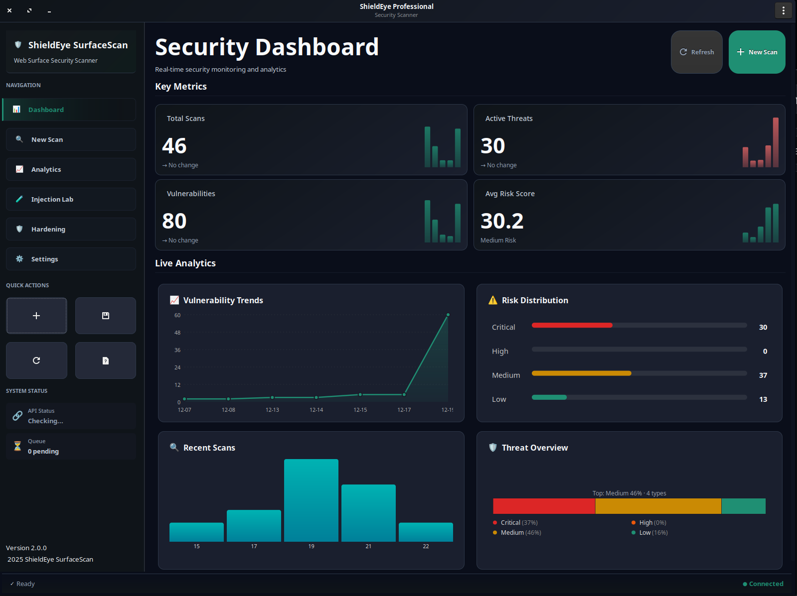
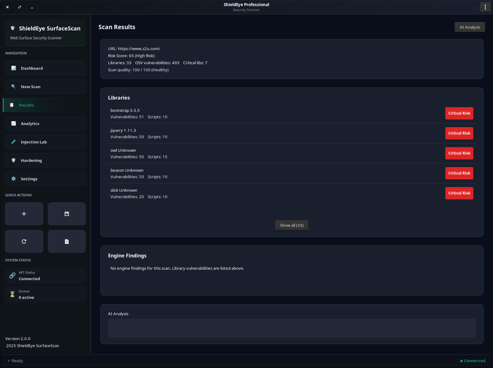
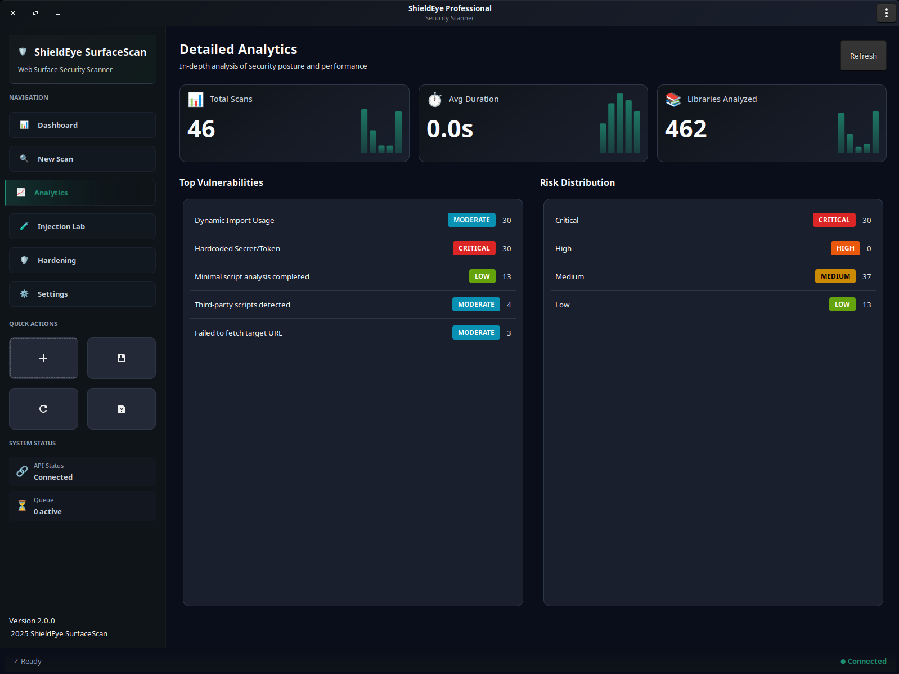
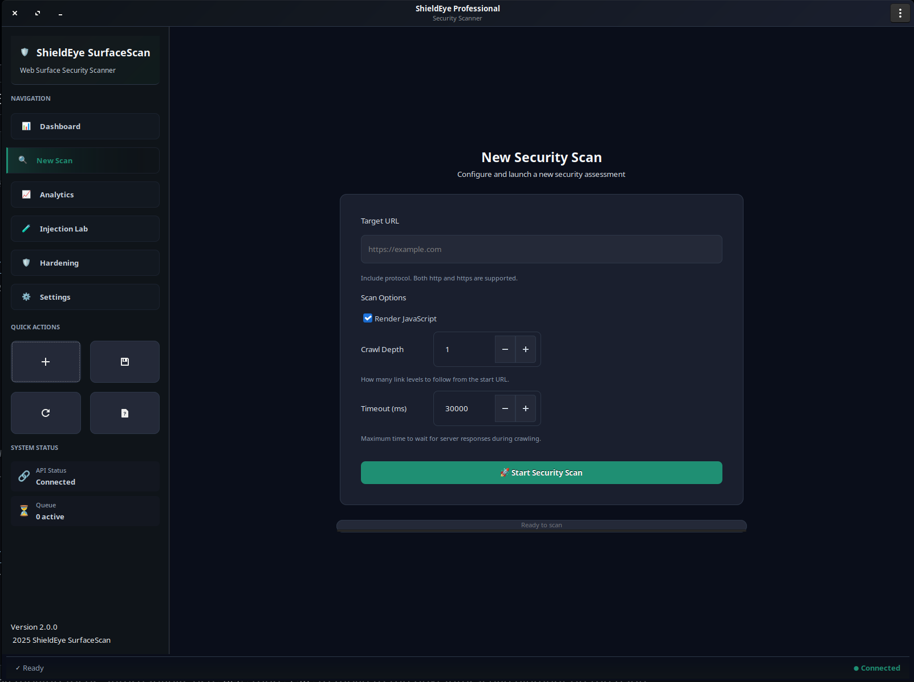

<div align="center">

# 🛡️ ShieldEye-SurfaceScan

**Web Application Surface Mapper (v1.0.0)**  
*Part of the [ShieldEye Security Toolkit](https://github.com/exiv703/ShieldEye-Core)*

[](#)
[](https://nodejs.org/)
[](LICENSE)
[](https://github.com/exiv703/ShieldEye-SurfaceScan/actions/workflows/test.yml)
[](#)

[What is SurfaceScan?](#-what-is-shieldeye-surfacescan) •
[Features](#-key-features) •
[Screenshots](#-screenshots) •
[Architecture](#️-architecture) •
[Quick Start](#-quick-start) •
[Configuration](#️-configuration) •
[API](#-api-usage) •
[Contributing](#-contributing)

</div>

---

## 🎯 What is ShieldEye-SurfaceScan?

ShieldEye-SurfaceScan is a **security-focused web surface mapping engine** for discovering externally exposed assets and analyzing attack surface quality at scale.

Maintainer note: this repo is biased toward conservative scan behavior. If in doubt, we prefer fewer requests over aggressive crawling.

It is designed for:
- **Subdomain discovery** (passive + active validation)
- **Technology fingerprinting** with explainable confidence scoring
- **Endpoint mapping** with strict scope controls and rate safety

> ⚠️ **Authorized use only:** ShieldEye-SurfaceScan must only be used on systems you own or have explicit written permission to assess.

---

## ✨ Key Features

| Capability | What it does | Security value |
|---|---|---|
| 🔍 **Surface Discovery** | Passive OSINT via `crt.sh` and SecurityTrails (mocked in tests), then active DNS + HTTP `HEAD` verification | Finds real, reachable assets while reducing false positives |
| 🛡️ **SSRF-Safe Validation** | Blocks localhost, private ranges, and metadata endpoints by default | Prevents scanner abuse and internal network pivoting |
| 🧠 **Tech Fingerprinting** | Header analysis (`Server`, `X-Powered-By`), HTML signature matching, framework/script heuristics | Identifies stack exposure and probable framework footprint |
| 📊 **Explainable Scoring** | `confidence_score` includes evidence and per-signal breakdown | Enables analyst trust, triage clarity, and auditability |
| 🗺️ **Endpoint Mapping** | In-scope crawling with depth/page caps, `GET`/`HEAD` only | Maps reachable routes without unsafe crawling behavior |
| 🧹 **Normalization + Dedupe** | Lowercased hosts, sorted query params, fragment removal | Produces stable endpoint inventories and clean diffing |
| ⏱️ **Thread-Safe Rate Limiting** | Per-host token bucket + `Retry-After` handling | Minimizes disruption and adapts safely to target limits |
| 🔐 **Production Foundations** | TLS-by-default (`rejectUnauthorized=true`), custom CA support, CI quality gates, pre-commit hooks | Safer defaults for real-world pipelines and team workflows |

---

## 🖼️ Screenshots

<div align="center">

| Surface Overview | Discovery Results |
|:--:|:--:|
|  |  |

| Analytics Overview | New Scan |
|:--:|:--:|
|  |  |

</div>

---

## 🏗️ Architecture

```text
┌─────────────────────────────────┐
│   ShieldEye-SurfaceScan v1.0.0  │
│   Web Surface Mapper            │
└────────────┬────────────────────┘
             │
    ┌────────┴────────┐
    ▼                 ▼
┌─────────┐    ┌─────────────┐
│Discovery│    │Fingerprint  │
│(OSINT+  │    │(Headers+    │
│ DNS+HTTP)│   │ HTML+JS)    │
└────┬────┘    └─────┬───────┘
     │               │
     ▼               ▼
┌─────────────────────────┐
│   Endpoint Mapper       │
│ (Crawl + Dedupe + Rate) │
└────────┬────────────────┘
         │
         ▼
┌─────────────────────────┐
│   Output: JSON findings │
│   • host + status       │
│   • tech + confidence   │
│   • endpoints + methods │
└─────────────────────────┘
```

Why this matters: this separation keeps discovery, fingerprinting, and endpoint mapping independently testable, so teams can tune scan depth or detection logic without destabilizing the rest of the pipeline.

---

## 🚀 Quick Start

If you want the shortest path to "first scan": install deps, copy `.env`, run API, send one `curl`.

### Clone repository

```bash
git clone https://github.com/exiv703/ShieldEye-SurfaceScan.git
cd ShieldEye-SurfaceScan
```

### Install dependencies

```bash
npm ci --prefix shared
npm ci --prefix api
npm ci --prefix analyzer
```

### Configure environment

```bash
cp .env.example .env
```

Edit `.env` with secure values (`DB_PASSWORD`, `MINIO_SECRET_KEY`, `JWT_SECRET`, `ENCRYPTION_KEY`) before running in non-dev environments.
For local-only hacking, you can start with placeholders and rotate them before pushing anywhere shared.

### Run services (CLI-first workflow)

```bash
# Option A: Full stack with containers
docker compose up -d

# Option B: Local API dev mode
npm run dev --prefix api
```

### Trigger a scan from CLI

```bash
curl -X POST http://localhost:3000/api/scans \
  -H "Content-Type: application/json" \
  -d '{"url":"https://example.com"}'
```

> 🧪 GUI is currently available as an auxiliary interface (`gtk_gui_pro`), but the primary v1.0.0 flow is API/CLI-driven.
>
> Dev note: if scan creation works but results look empty, check API logs first — in practice this catches misconfigured env values faster than stepping through the GUI.

---

## ⚙️ Configuration

### Security and runtime flags

Real-world hint: keep `ENABLE_EXPERIMENTAL_API=false` on shared/staging unless someone is actively testing those routes.

| Variable | Default | Description |
|---|---:|---|
| `ENABLE_EXPERIMENTAL_API` | `false` | Enables experimental routes (`/api/monitoring`, `/api/blockchain`, `/api/quantum`, `/api/settings`) |
| `ENABLE_MINIMAL_ROUTES` | `false` | Enables legacy minimal API router under `/api/minimal` |
| `ENABLE_METRICS` | `true` | Exposes `/metrics` endpoint |
| `ENABLE_HEALTH_CHECKS` | `true` | Enables health/readiness/liveness endpoints |

### TLS defaults (secure by default)

| Variable | Default | Description |
|---|---:|---|
| `TLS_ENABLED` | `true` | Enables TLS-aware client configuration |
| `TLS_REJECT_UNAUTHORIZED` | `true` | Rejects invalid/untrusted certificates |
| `TLS_CA_CERT_PATH` | _(unset)_ | Optional custom CA certificate path |
| `TLS_MIN_VERSION` | `TLSv1.2` | Minimum accepted TLS version (`TLSv1.2` / `TLSv1.3`) |

---

## 📚 Documentation

| Document | Purpose |
|---|---|
| [`REQUIREMENTS.md`](REQUIREMENTS.md) | Platform requirements and setup baseline |
| [`docs/guides/INTEGRATION_GUIDE.md`](docs/guides/INTEGRATION_GUIDE.md) | Backend + GUI integration notes |
| [`docs/reports/SHIELDEYE_BACKEND_SCANNER_REPORT.md`](docs/reports/SHIELDEYE_BACKEND_SCANNER_REPORT.md) | Technical architecture/report context |
| [ShieldEye-Core](https://github.com/exiv703/ShieldEye-Core) | Parent toolkit and reference architecture |

---

## 🔌 API Usage

### Core endpoints

| Method | Endpoint | Description |
|---|---|---|
| `POST` | `/api/scans` | Create scan |
| `GET` | `/api/scans/:id/status` | Get scan status |
| `GET` | `/api/scans/:id/results` | Get scan results |
| `GET` | `/api/scans/:id/surface` | Get mapped attack surface |
| `GET` | `/health` | Health check |
| `GET` | `/metrics` | Metrics endpoint (if enabled) |

### Programmatic TypeScript example

This is intentionally plain `fetch` (no SDK wrapper) so teams can paste it into scripts or CI smoke checks.

```ts
type CreateScanResponse = { id: string; status: string };

async function createAndPollScan(baseUrl: string, targetUrl: string) {
  const createRes = await fetch(`${baseUrl}/api/scans`, {
    method: "POST",
    headers: { "Content-Type": "application/json" },
    body: JSON.stringify({ url: targetUrl }),
  });

  if (!createRes.ok) {
    throw new Error(`Scan creation failed: ${createRes.status}`);
  }

  const created = (await createRes.json()) as CreateScanResponse;
  const scanId = created.id;

  for (;;) {
    const statusRes = await fetch(`${baseUrl}/api/scans/${scanId}/status`);
    if (!statusRes.ok) throw new Error(`Status check failed: ${statusRes.status}`);

    const statusData = await statusRes.json();
    if (statusData.status === "completed") {
      const resultsRes = await fetch(`${baseUrl}/api/scans/${scanId}/results`);
      if (!resultsRes.ok) throw new Error(`Results fetch failed: ${resultsRes.status}`);
      return resultsRes.json();
    }

    if (statusData.status === "failed") {
      throw new Error(`Scan ${scanId} failed`);
    }

    await new Promise((r) => setTimeout(r, 1500));
  }
}
```

---

## 🧪 Development

### Test, lint, typecheck

```bash
# Lint
npx --no-install --prefix api eslint .
npx --no-install --prefix analyzer eslint .

# Typecheck
npx --no-install --prefix api tsc --noEmit
npx --no-install --prefix analyzer tsc --noEmit

# Tests
npm test --prefix api -- --ci
npm test --prefix analyzer -- --ci

# Coverage gate (target 85%+ release standard)
npm test --prefix api -- --ci --coverage
npm test --prefix analyzer -- --ci --coverage
```

### Pre-commit hooks

```bash
pip install pre-commit
pre-commit install
pre-commit run --all-files
```

---

## 🤝 Contributing

We welcome security-minded contributions.

Please follow these guidelines:
1. Keep changes **small, scoped, and test-backed**.
2. Follow **TypeScript + ESLint** conventions across Node services.
3. Use clear typing (`zod` schemas, explicit interfaces/types) for externally facing structures.
4. Add or update tests for scanner logic, validation, and orchestration behavior.
5. Maintain secure defaults (SSRF protections, TLS validation, bounded crawling).

PR checklist:
- [ ] Lint passes
- [ ] Typecheck passes
- [ ] Tests pass
- [ ] Coverage maintained or improved
- [ ] No secrets or unsafe defaults introduced

---

## 📝 License

This project is licensed under the **MIT License**. See [`LICENSE`](LICENSE) for details.
